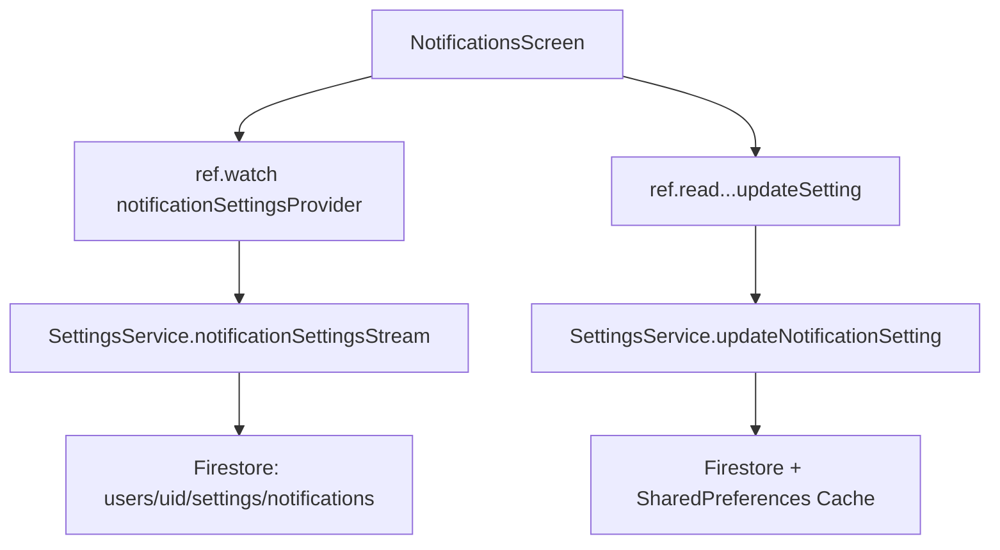

# Settings Feature Deep Dive Analysis Report

**Analysis Date:** January 22, 2026  
**Analyst:** AI Documentation Agent  
**Feature:** `lib/features/settings`  
**Production Readiness:** ~30% (User Estimate)

---

## Executive Summary

This comprehensive analysis documents the entire Settings feature module of the Journeyman Jobs application. The Settings feature provides users with access to profile management, app preferences, notification controls, and support resources. The current implementation is **partially complete** with significant gaps in data persistence, Firestore integration, and cross-device sync capabilities.

### Key Findings

| Category | Status | Issues |
|----------|--------|--------|
| **UI/UX** | ✅ 85% Complete | Well-designed, consistent styling |
| **Navigation** | ✅ 95% Complete | All routes defined and working |
| **Data Models** | ✅ 90% Complete | Firestore models defined |
| **Firestore Service** | ✅ 95% Complete | Full CRUD operations |
| **Riverpod Providers** | ⚠️ 70% Complete | Partially integrated |
| **Screen Integration** | ⚠️ 30% Complete | Most screens use SharedPreferences |
| **Offline Support** | ⚠️ 50% Complete | Caching layer exists but untested |
| **Testing** | ❌ 0% Complete | No unit/widget tests |

---

## Directory Structure

```
lib/features/settings/
├── models/
│   └── settings_models.dart          (15,061 bytes) - Firestore data models
├── providers/
│   ├── settings_providers.dart       (10,577 bytes) - Riverpod state management
│   └── settings_providers.g.dart     (4,318 bytes)  - Generated code
├── screens/
│   ├── settings_screen.dart          (19,184 bytes) - Main settings hub ✅ Riverpod
│   ├── appearance_display_screen.dart (12,434 bytes) - Theme settings ✅ Riverpod
│   ├── notifications_settings_screen.dart (38,188 bytes) - Notifications ✅ Riverpod
│   ├── job_search_preferences_screen.dart (11,606 bytes) - Job filters ❌ SharedPrefs
│   ├── privacy_security_screen.dart  (9,037 bytes)  - Privacy settings ❌ SharedPrefs
│   ├── language_region_screen.dart   (6,369 bytes)  - i18n settings ❌ SharedPrefs
│   ├── data_storage_screen.dart      (7,828 bytes)  - Storage mgmt ❌ SharedPrefs
│   ├── feedback_screen.dart          (11,881 bytes) - User feedback ✅ Firestore
│   ├── help_support_screen.dart      (25,613 bytes) - Help & FAQ ✅ Static
│   ├── resources_screen.dart         (19,025 bytes) - Resources ✅ Static
│   ├── app_settings_screen.dart      (15,667 bytes) - Combined settings
│   └── sync_settings_screen.dart     (19,207 bytes) - Sync controls
├── services/
│   └── settings_service.dart         (14,317 bytes) - Firestore operations
└── settings.dart                     (611 bytes)    - Barrel file
```

---

## 1. SETTINGS SCREEN (Main Hub)

**File:** `settings_screen.dart`  
**Lines:** 523  
**Route:** `/settings`  
**State Management:** ✅ Riverpod `ConsumerStatefulWidget`

### Screen Layout

```
┌─────────────────────────────────────────────┐
│ AppBar: "Settings"                          │
├─────────────────────────────────────────────┤
│ ┌─────────────────────────────────────────┐ │
│ │ User Profile Card                       │ │
│ │ ┌─────┐ Display Name                    │ │
│ │ │ 👤  │ Ticket #XXXXX                  │ │
│ │ └─────┘ [Edit Profile Button]           │ │
│ └─────────────────────────────────────────┘ │
│                                             │
│ ACCOUNT Section                             │
│ ├─ Profile → /profile?edit=true             │
│ ├─ Training & Certificates → /training     │
│ └─ Job Search Preferences → /settings/job-search-preferences│
│                                             │
│ SUPPORT Section                             │
│ ├─ Help & Support → /help                   │
│ ├─ Resources → /resources                   │
│ └─ Send Feedback → /feedback                │
│                                             │
│ APP Section                                 │
│ ├─ Notifications → /notifications?tab=settings │
│ ├─ Appearance & Display → /settings/appearance-display │
│ ├─ Data & Storage → /settings/data-storage  │
│ ├─ Language & Region → /settings/language-region │
│ ├─ Privacy & Security → /settings/privacy-security │
│ └─ About → [Dialog]                         │
│                                             │
│ [Sign Out Button]                           │
└─────────────────────────────────────────────┘
```

### Navigation Map

| Menu Item | Icon | Route Path | Target Screen |
|-----------|------|------------|---------------|
| Profile | `person_outline` | `/profile?edit=true` | `ProfileScreen` |
| Training & Certificates | `badge_outlined` | `/training` | `TrainingCertificatesScreen` |
| Job Search Preferences | `work_outline` | `/settings/job-search-preferences` | `JobSearchPreferencesScreen` |
| Help & Support | `help_outline` | `/help` | `HelpSupportScreen` |
| Resources | `library_books_outlined` | `/resources` | `ResourcesScreen` |
| Send Feedback | `feedback_outlined` | `/feedback` | `FeedbackScreen` |
| Notifications | `notifications_outlined` | `/notifications?tab=settings` | `NotificationsScreen` |
| Appearance & Display | `color_lens_outlined` | `/settings/appearance-display` | `AppearanceDisplayScreen` |
| Data & Storage | `data_usage_outlined` | `/settings/data-storage` | `DataStorageScreen` |
| Language & Region | `language_outlined` | `/settings/language-region` | `LanguageRegionScreen` |
| Privacy & Security | `security_outlined` | `/settings/privacy-security` | `PrivacySecurityScreen` |
| About | `info_outline` | N/A (Dialog) | `_showAboutDialog()` |

### Data Flow

```mermaid
graph TD
    A[SettingsScreen] --> B[FirebaseAuth.currentUser]
    A --> C[userModelStreamProvider]
    C --> D[Firestore: users/{uid}]
    A --> E[Edit Profile Button]
    E --> F[ProfileScreen]
    A --> G[Sign Out]
    G --> H[FirebaseAuth.signOut]
    H --> I[WelcomeScreen]
```

### Code Issues

| Line | Issue | Severity | Recommendation |
|------|-------|----------|----------------|
| 26-27 | Direct FirebaseAuth access | Medium | Use auth provider |
| 493-506 | No error logging in signOut | Low | Add error reporting |
| 359-419 | About dialog has hardcoded version | Low | Use package_info_plus |

### Debug Features

- **Hidden Debug Menu:** Long-press on version number in About dialog
- **Reset Onboarding:** Clears onboarding status for testing

---

## 2. ACCOUNT Section Screens

### 2.1 Profile Screen (External)

**Route:** `/profile?edit=true`  
**Location:** `lib/features/jobs/profile/`  
**Note:** Outside settings feature - profile management

### 2.2 Training & Certificates Screen (External)

**Route:** `/training`  
**Location:** External feature
**Note:** Certificate and training management

### 2.3 Job Search Preferences Screen

**File:** `job_search_preferences_screen.dart`  
**Lines:** 355  
**Route:** `/settings/job-search-preferences`  
**State Management:** ❌ StatefulWidget + SharedPreferences

#### Screen Layout

```
┌─────────────────────────────────────────────┐
│ AppBar: "Job Search Preferences"            │
├─────────────────────────────────────────────┤
│ SEARCH FILTERS Section                      │
│ ┌─────────────────────────────────────────┐ │
│ │ 📍 Default Search Radius                │ │
│ │    50 Miles                             │ │
│ │    [═══════════●═══════════] 10-500     │ │
│ ├─────────────────────────────────────────┤ │
│ │ 📏 Distance Units                       │ │
│ │    [Miles ▼]                            │ │
│ ├─────────────────────────────────────────┤ │
│ │ 💵 Minimum Hourly Rate                  │ │
│ │    $35.00/hr                            │ │
│ │    [═══════●═══════════════] $20-$100   │ │
│ └─────────────────────────────────────────┘ │
│                                             │
│ APPLICATION AUTOMATION Section              │
│ ┌─────────────────────────────────────────┐ │
│ │ ⚡ Auto-Apply                     [OFF] │ │
│ │    Automatically apply to matching jobs │ │
│ └─────────────────────────────────────────┘ │
└─────────────────────────────────────────────┘
```

#### Settings Data

| Setting | Type | Key | Default | Range |
|---------|------|-----|---------|-------|
| Default Search Radius | `double` | `default_search_radius` | 50.0 | 10-500 |
| Distance Units | `String` | `units` | "Miles" | Miles, Kilometers |
| Minimum Hourly Rate | `double` | `minimum_hourly_rate` | 35.0 | 20-100 |
| Auto-Apply | `bool` | `auto_apply` | false | - |

#### Production Issues

| Issue | Severity | Description |
|-------|----------|-------------|
| ❌ SharedPreferences Only | **CRITICAL** | Settings not synced to Firestore |
| ❌ No Validation | High | No min/max validation in UI |
| ❌ No Riverpod Integration | High | Not using `jobSearchSettingsProvider` |
| ⚠️ No Loading State | Medium | No skeleton loader |

#### Required Changes

```dart
// BEFORE (Current)
class JobSearchPreferencesScreen extends StatefulWidget

// AFTER (Required)
class JobSearchPreferencesScreen extends ConsumerStatefulWidget
// Use ref.watch(jobSearchSettingsProvider)
// Call ref.read(jobSearchSettingsProvider.notifier).setSearchRadius(value)
```

---

## 3. SUPPORT Section Screens

### 3.1 Help & Support Screen

**File:** `help_support_screen.dart`  
**Lines:** 729  
**Route:** `/help`  
**State Management:** StatefulWidget (Static Content)

#### Screen Layout - 3 Tabs

```
┌─────────────────────────────────────────────┐
│ TabBar: [FAQ] [Contact] [Guides]            │
├─────────────────────────────────────────────┤
│ FAQ TAB                                     │
│ ┌─────────────────────────────────────────┐ │
│ │ 🔍 Search FAQ...                        │ │
│ └─────────────────────────────────────────┘ │
│ Account ▸ How do I update my IBEW local...  │
│ Jobs ▸ How do I apply for storm work?       │
│ Safety ▸ What safety info should I know?    │
│ Technical ▸ Why no notifications?           │
├─────────────────────────────────────────────┤
│ CONTACT TAB                                 │
│ 📧 Email Support → support@journeymanjobs.com │
│ 📞 Phone Support → 1-800-JOURNEYMAN         │
│ 💬 Live Chat → Coming Soon                  │
│ 🐛 Report Bug → Coming Soon                 │
│ ⚠️ Emergency Safety Issues Panel            │
├─────────────────────────────────────────────┤
│ GUIDES TAB                                  │
│ 📝 Setting Up Your Profile                  │
│ 💼 Finding and Applying for Jobs            │
│ ⚡ Storm Work Opportunities                 │
│ 🏢 Working with Different Locals            │
│ 🔔 Managing Notifications                   │
└─────────────────────────────────────────────┘
```

#### FAQ Categories

| Category | Questions | Topics |
|----------|-----------|--------|
| Account | 2 | IBEW local info, job preferences |
| Jobs | 3 | Storm work, book signing, matching |
| Locals | 2 | Finding locals, working across jurisdictions |
| Technical | 3 | Notifications, performance, password reset |
| Safety | 2 | Storm safety, reporting hazards |

#### Production Status: ✅ READY

- Static content, no data persistence required
- FAQ search working
- Contact actions copy to clipboard

### 3.2 Resources Screen

**File:** `resources_screen.dart`  
**Lines:** 597  
**Route:** `/resources`  
**State Management:** StatefulWidget (Static Content)

#### Screen Layout - 3 Tabs

```
┌─────────────────────────────────────────────┐
│ TabBar: [Documents] [Tools] [Links]         │
├─────────────────────────────────────────────┤
│ DOCUMENTS TAB                               │
│ IBEW Documents ▸ Constitution, Code of Excellence │
│ Safety ▸ NFPA 70E, OSHA Standards           │
│ Technical ▸ NEC, IEEE Standards             │
├─────────────────────────────────────────────┤
│ TOOLS TAB                                   │
│ Calculators ▸ Voltage Drop, Conduit Fill, Load │
│ Reference ▸ Wire Chart, Conduit Chart, Symbols │
├─────────────────────────────────────────────┤
│ LINKS TAB                                   │
│ IBEW Official ▸ ibew.org                    │
│ Training ▸ IBEW Training, NECA Education    │
│ Safety ▸ NFPA                               │
│ Government ▸ DOL                            │
└─────────────────────────────────────────────┘
```

#### Tool Navigation

| Tool Action | Navigation |
|-------------|------------|
| `voltage_drop_calc` | `VoltageDropCalculator()` |
| `conduit_fill_calc` | `ConduitFillCalculator()` |
| `load_calc` | `LoadCalculator()` |
| `wire_chart` | `WireSizeChart()` |
| `transformer_banks` | `/tools/transformer-reference` |

#### Production Status: ✅ READY

### 3.3 Feedback Screen

**File:** `feedback_screen.dart`  
**Lines:** 327  
**Route:** `/feedback`  
**State Management:** StatefulWidget + Firestore

#### Screen Layout

```
┌─────────────────────────────────────────────┐
│ Header Card: "We Value Your Input"          │
├─────────────────────────────────────────────┤
│ Feedback Details                            │
│ ┌─────────────────────────────────────────┐ │
│ │ Category: [General ▼]                   │ │
│ │ Your Email: [prefilled]                 │ │
│ │ Subject: [________________]             │ │
│ │ Message: [________________________     │ │
│ │          ________________________      │ │
│ │          ________________________]     │ │
│ │ [Submit Feedback]                       │ │
│ └─────────────────────────────────────────┘ │
└─────────────────────────────────────────────┘
```

#### Firestore Collection

**Collection:** `feedback`

```json
{
  "userId": "string (nullable)",
  "userEmail": "string",
  "category": "string",
  "subject": "string",
  "message": "string",
  "timestamp": "ServerTimestamp",
  "status": "open",
  "platform": "mobile",
  "appVersion": "1.0.0"
}
```

#### Categories

- General
- Bug Report
- Feature Request
- Job Search Issues
- App Performance
- User Interface
- Safety Features
- Local Union Support

#### Production Status: ✅ READY

---

## 4. APP Section Screens

### 4.1 Notifications Settings Screen

**File:** `notifications_settings_screen.dart`  
**Lines:** ~950 (refactored)  
**Route:** `/notifications?tab=settings`  
**State Management:** ✅ Riverpod `ConsumerStatefulWidget`

#### Screen Layout - 2 Tabs

```
┌─────────────────────────────────────────────┐
│ TabBar: [Notifications] [Settings]          │
├─────────────────────────────────────────────┤
│ NOTIFICATIONS TAB                           │
│ Filter: [All] [Jobs] [Safety] [System] ...  │
│ [Mark all as read]                          │
│ ┌─────────────────────────────────────────┐ │
│ │ Notification Card (from Firestore)      │ │
│ └─────────────────────────────────────────┘ │
├─────────────────────────────────────────────┤
│ SETTINGS TAB                                │
│ ┌─────────────────────────────────────────┐ │
│ │ 🔔 Notifications Master Toggle [ON/OFF] │ │
│ └─────────────────────────────────────────┘ │
│ Notification Types                          │
│ ├─ Job Alerts [ON]                          │
│ ├─ Union Updates [ON]                       │
│ ├─ System Notifications [ON]                │
│ ├─ Storm Work [ON]                          │
│ └─ Union Reminders [ON]                     │
│ Sound & Vibration                           │
│ ├─ Sound [ON]                               │
│ └─ Vibration [ON]                           │
│ Quiet Hours                                 │
│ └─ [OFF] Start: 10:00 PM  End: 7:00 AM     │
└─────────────────────────────────────────────┘
```

#### Settings Data Model

**Model:** `NotificationSettingsModel`  
**Firestore Path:** `users/{uid}/settings/notifications`

| Field | Type | Default |
|-------|------|---------|
| notificationsEnabled | bool | true |
| jobAlertsEnabled | bool | true |
| unionUpdatesEnabled | bool | true |
| systemNotificationsEnabled | bool | true |
| stormWorkEnabled | bool | true |
| unionRemindersEnabled | bool | true |
| soundEnabled | bool | true |
| vibrationEnabled | bool | true |
| quietHoursEnabled | bool | false |
| quietHoursStart | int | 22 |
| quietHoursEnd | int | 7 |
| fcmToken | String? | null |

#### Data Flow



#### Production Status: ✅ REFACTORED - Ready for Testing

### 4.2 Appearance & Display Screen

**File:** `appearance_display_screen.dart`  
**Lines:** 285  
**Route:** `/settings/appearance-display`  
**State Management:** ✅ Riverpod `ConsumerStatefulWidget`

#### Screen Layout

```
┌─────────────────────────────────────────────┐
│ AppBar: "Appearance & Display"              │
├─────────────────────────────────────────────┤
│ THEME SETTINGS                              │
│ ├─ 🌙 Dark Mode [OFF]                       │
│ ├─ 🔆 High Contrast [OFF]                   │
│ ├─ ⚡ Electrical Effects [ON]               │
│ └─ 🔤 Font Size [Medium ▼]                  │
│                                             │
│ DEVELOPER TOOLS                             │
│ └─ 🛠️ Circuit Background Demo →             │
└─────────────────────────────────────────────┘
```

#### Settings Data Model

**Model:** `AppearanceSettingsModel`  
**Firestore Path:** `users/{uid}/settings/appearance`

| Field | Type | Default |
|-------|------|---------|
| darkModeEnabled | bool | false |
| highContrastEnabled | bool | false |
| electricalEffectsEnabled | bool | true |
| fontSize | String | "Medium" |
| circuitBackground | Object | (nested) |

#### Production Status: ✅ REFACTORED - Ready for Testing

### 4.3 Data & Storage Screen

**File:** `data_storage_screen.dart`  
**Lines:** 232  
**Route:** `/settings/data-storage`  
**State Management:** ❌ StatefulWidget + SharedPreferences

#### Screen Layout

```
┌─────────────────────────────────────────────┐
│ AppBar: "Data & Storage"                    │
├─────────────────────────────────────────────┤
│ OFFLINE CAPABILITIES                        │
│ └─ ☁️ Offline Mode [OFF]                    │
│                                             │
│ DOWNLOADS                                   │
│ ├─ ⬇️ Auto-Download [ON]                    │
│ └─ 📶 WIFI-Only Downloads [ON]              │
│                                             │
│ STORAGE MANAGEMENT                          │
│ └─ 💾 Clear Cache (42.5 MB) [Clear]         │
└─────────────────────────────────────────────┘
```

#### Settings Data

| Setting | Key | Default |
|---------|-----|---------|
| Offline Mode | `offlineMode` | false |
| Auto-Download | `autoDownload` | true |
| WIFI-Only | `wifiOnly` | true |

#### Production Issues

| Issue | Severity |
|-------|----------|
| ❌ SharedPreferences Only | CRITICAL |
| ❌ Cache size is hardcoded | High |
| ❌ Clear cache is simulated | High |
| ❌ No Riverpod integration | High |

### 4.4 Language & Region Screen

**File:** `language_region_screen.dart`  
**Lines:** 200  
**Route:** `/settings/language-region`  
**State Management:** ❌ StatefulWidget + SharedPreferences

#### Screen Layout

```
┌─────────────────────────────────────────────┐
│ AppBar: "Language & Region"                 │
├─────────────────────────────────────────────┤
│ REGIONAL PREFERENCES                        │
│ ├─ 🌐 Language [English ▼]                  │
│ ├─ 📅 Date Format [MM/DD/YYYY ▼]            │
│ └─ 🕐 Time Format [12-hour ▼]               │
└─────────────────────────────────────────────┘
```

#### Settings Data

| Setting | Key | Options |
|---------|-----|---------|
| Language | `language` | English, Spanish, French |
| Date Format | `date_format` | MM/DD/YYYY, DD/MM/YYYY, YYYY-MM-DD |
| Time Format | `time_format` | 12-hour, 24-hour |

#### Production Issues

| Issue | Severity |
|-------|----------|
| ❌ SharedPreferences Only | CRITICAL |
| ❌ No actual i18n implementation | CRITICAL |
| ❌ No Riverpod integration | High |

### 4.5 Privacy & Security Screen

**File:** `privacy_security_screen.dart`  
**Lines:** 274  
**Route:** `/settings/privacy-security`  
**State Management:** ❌ StatefulWidget + SharedPreferences

#### Screen Layout

```
┌─────────────────────────────────────────────┐
│ AppBar: "Privacy & Security"                │
├─────────────────────────────────────────────┤
│ PRIVACY CONTROLS                            │
│ ├─ 👁️ Profile Visibility [Union Members Only ▼] │
│ └─ 📍 Location Services [ON]                │
│                                             │
│ ACCOUNT SECURITY                            │
│ ├─ 🔐 Biometric Login [OFF]                 │
│ └─ 🛡️ Two-Factor Auth [OFF]                 │
└─────────────────────────────────────────────┘
```

#### Settings Data

| Setting | Key | Options/Default |
|---------|-----|-----------------|
| Profile Visibility | `profile_visibility` | Public, Union Members Only, Private |
| Location Services | `location_services` | true |
| Biometric Login | `biometric_login` | false |
| Two-Factor Auth | `two_factor` | false |

#### Production Issues

| Issue | Severity |
|-------|----------|
| ❌ SharedPreferences Only | CRITICAL |
| ❌ Biometric not implemented | High |
| ❌ 2FA not implemented | High |
| ❌ No Riverpod integration | High |

---

## 5. Data Layer Analysis

### 5.1 Settings Models (`settings_models.dart`)

**Status:** ✅ Production Ready

```dart
// Three main models with full Firestore support:

1. AppearanceSettingsModel
   - Firestore Path: users/{uid}/settings/appearance
   - Includes: CircuitBackgroundSettings (nested)
   - Methods: fromFirestore(), toFirestore(), copyWith()

2. NotificationSettingsModel
   - Firestore Path: users/{uid}/settings/notifications
   - Includes: FCM token storage
   - Methods: fromFirestore(), toFirestore(), copyWith()

3. JobSearchSettingsModel
   - Firestore Path: users/{uid}/settings/jobSearch
   - Includes: Preferred job types, locals lists
   - Methods: fromFirestore(), toFirestore(), copyWith()
```

### 5.2 Settings Service (`settings_service.dart`)

**Status:** ✅ Production Ready

| Method | Description |
|--------|-------------|
| `appearanceSettingsStream()` | Real-time Firestore stream |
| `getAppearanceSettings()` | Single fetch |
| `updateAppearanceSettings()` | Full model update + cache |
| `updateAppearanceSetting()` | Single field update |
| `loadCachedAppearanceSettings()` | SharedPreferences fallback |
| `migrateFromSharedPreferences()` | One-time migration |

### 5.3 Settings Providers (`settings_providers.dart`)

**Status:** ⚠️ Partially Complete

| Provider | Type | Status |
|----------|------|--------|
| `settingsServiceProvider` | Provider | ✅ Ready |
| `appearanceSettingsProvider` | AsyncNotifier | ✅ Ready |
| `notificationSettingsProvider` | AsyncNotifier | ✅ Ready |
| `jobSearchSettingsProvider` | AsyncNotifier | ✅ Ready |

---

## 6. Production Readiness Checklist

### Screens Requiring Riverpod Refactor

| Screen | Current State | Required Action |
|--------|--------------|-----------------|
| `job_search_preferences_screen.dart` | SharedPreferences | Refactor to `jobSearchSettingsProvider` |
| `privacy_security_screen.dart` | SharedPreferences | Create new provider or extend existing |
| `language_region_screen.dart` | SharedPreferences | Create new provider or extend existing |
| `data_storage_screen.dart` | SharedPreferences | Create new provider or extend existing |

### Missing Features

| Feature | Priority | Notes |
|---------|----------|-------|
| Real i18n with flutter_localizations | High | Language selector exists but no translations |
| Biometric authentication | High | LocalAuthentication package needed |
| Two-factor authentication | Medium | Firebase Phone Auth or TOTP |
| Real cache management | Medium | path_provider + file operations |
| Offline mode sync | Medium | Firestore offline persistence |
| Cross-device sync indicator | Low | Show sync status in UI |

### Testing Requirements

| Test Type | Files Needed |
|-----------|-------------|
| Unit Tests | `settings_service_test.dart`, `settings_models_test.dart` |
| Widget Tests | All screen files |
| Integration Tests | Settings flow E2E |

---

## 7. Recommended Action Items

### Phase 1: Critical (Week 1)

1. ✅ Refactor `appearance_display_screen.dart` - DONE
2. ✅ Refactor `notifications_settings_screen.dart` - DONE
3. 🔲 Refactor `job_search_preferences_screen.dart`
4. 🔲 Add PrivacySecuritySettingsModel to models
5. 🔲 Refactor `privacy_security_screen.dart`

### Phase 2: High Priority (Week 2)

1. 🔲 Add LanguageRegionSettingsModel
2. 🔲 Refactor `language_region_screen.dart`
3. 🔲 Add DataStorageSettingsModel
4. 🔲 Refactor `data_storage_screen.dart`
5. 🔲 Implement real cache management

### Phase 3: Enhancements (Week 3+)

1. 🔲 Add flutter_localizations for i18n
2. 🔲 Implement biometric authentication
3. 🔲 Add sync status indicators
4. 🔲 Write unit tests
5. 🔲 Write widget tests

---

## Appendix A: Route Reference

| Route Constant | Path | Screen |
|----------------|------|--------|
| `AppRouter.settings` | `/settings` | `SettingsScreen` |
| `AppRouter.profile` | `/profile` | `ProfileScreen` |
| `AppRouter.training` | `/training` | `TrainingCertificatesScreen` |
| `AppRouter.jobSearchPreferences` | `/settings/job-search-preferences` | `JobSearchPreferencesScreen` |
| `AppRouter.help` | `/help` | `HelpSupportScreen` |
| `AppRouter.resources` | `/resources` | `ResourcesScreen` |
| `AppRouter.feedback` | `/feedback` | `FeedbackScreen` |
| `AppRouter.notifications` | `/notifications` | `NotificationsScreen` |
| `AppRouter.appearanceDisplay` | `/settings/appearance-display` | `AppearanceDisplayScreen` |
| `AppRouter.dataStorage` | `/settings/data-storage` | `DataStorageScreen` |
| `AppRouter.languageRegion` | `/settings/language-region` | `LanguageRegionScreen` |
| `AppRouter.privacySecurity` | `/settings/privacy-security` | `PrivacySecurityScreen` |
| `AppRouter.circuitBackgroundDemo` | `/demo/circuit-background` | `CircuitBackgroundDemoScreen` |

---

## Appendix B: Firestore Schema

```
users/
└── {uid}/
    └── settings/
        ├── appearance/
        │   ├── darkModeEnabled: boolean
        │   ├── highContrastEnabled: boolean
        │   ├── electricalEffectsEnabled: boolean
        │   ├── fontSize: string
        │   ├── circuitBackground: {
        │   │   opacity: number,
        │   │   animationSpeed: number,
        │   │   componentDensity: string,
        │   │   theme: string,
        │   │   substrateColor: string
        │   │ }
        │   ├── updatedAt: timestamp
        │   └── version: number
        │
        ├── notifications/
        │   ├── notificationsEnabled: boolean
        │   ├── jobAlertsEnabled: boolean
        │   ├── unionUpdatesEnabled: boolean
        │   ├── systemNotificationsEnabled: boolean
        │   ├── stormWorkEnabled: boolean
        │   ├── unionRemindersEnabled: boolean
        │   ├── soundEnabled: boolean
        │   ├── vibrationEnabled: boolean
        │   ├── quietHoursEnabled: boolean
        │   ├── quietHoursStart: number
        │   ├── quietHoursEnd: number
        │   ├── fcmToken: string?
        │   ├── tokenUpdatedAt: timestamp?
        │   ├── updatedAt: timestamp
        │   └── version: number
        │
        └── jobSearch/
            ├── defaultSearchRadius: number
            ├── distanceUnits: string
            ├── minimumHourlyRate: number
            ├── autoApplyEnabled: boolean
            ├── autoApplyMaxPerDay: number
            ├── preferredJobTypes: array
            ├── preferredLocals: array
            ├── availableImmediately: boolean
            ├── earliestStartDate: timestamp?
            ├── updatedAt: timestamp
            └── version: number

feedback/
└── {feedbackId}/
    ├── userId: string?
    ├── userEmail: string
    ├── category: string
    ├── subject: string
    ├── message: string
    ├── timestamp: timestamp
    ├── status: string
    ├── platform: string
    └── appVersion: string
```

---

*Report generated by AI Documentation Agent - January 22, 2026*
