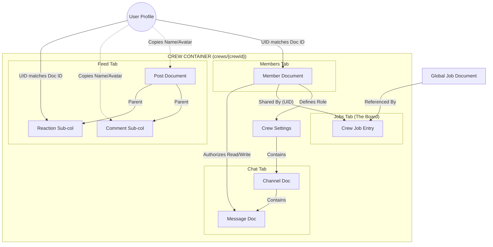

# SCRATCHPAD

This is the **Journeyman Jobs "Tailboard" Master Schema**.

This document is designed to be your **Source of Truth**. It contains the structure, the data types, the optimization strategies (denormalization), and the security logic required to build the feature exactly as we discussed.

## **Architectural Overview**

* **Pattern:** Subcollection-Heavy (Scalable & Secure).
* **Root:** `crews/{crewId}` acts as the container.
* **Security:** Access is determined strictly by the existence of a document in the `members` subcollection.
* **Optimization:** "Snapshots" (User Name/Avatar) are stored on every post/message to prevent excessive reads of the user profile collection.

---

### **1. Root Collection: `crews**

*Stores the settings and meta-data for the crew itself.*

* **Path:** `crews/{crewId}`
* **Doc ID:** Unique String (e.g., `sparky_crew_882` or Auto-ID)

| Field | Type | Description |
| --- | --- | --- |
| `name` | String | Display name of the crew. |
| `description` | String | Short bio/manifesto. |
| `logoUrl` | String | URL to Firebase Storage image. |
| `privacy` | String | Enum: `'open'`, `'inviteOnly'`, `'private'`. |
| `memberCount` | Integer | Counter. Updated via Cloud Function/Transaction on join/leave. |
| `jobCount` | Integer | Counter. Number of active jobs on the board. |
| `createdAt` | Timestamp | When the crew was founded. |
| `updatedAt` | Timestamp | Last settings change. |
| `location` | Map | `{ 'city': 'London', 'state': 'KY', 'zip': '40741' }` |
| `tags` | Array<String> | Search tags (e.g., `['lineman', 'storm', 'traveling']`). |

**Security Logic:**

* **Read:** Public (for search) or Authenticated Only.
* **Write:** **Foreman Only** (Checked via `members` subcollection).

---

### **2. Tab 1: Members (`members` Subcollection)**

*The roster. This is the "Key" to the security system.*

* **Path:** `crews/{crewId}/members/{userId}`
* **Doc ID:** **MUST be the User's Auth UID.**

| Field | Type | Description |
| --- | --- | --- |
| `uid` | String | Redundant, but useful for serialization. |
| `role` | String | Strictly `'Foreman'` or `'Member'`. |
| `joinedAt` | Timestamp | Date joined. |
| `status` | String | `'active'`, `'suspended'`. |
| `userSnapshot` | Map | **Cached Data** (See below). |
| `...displayName` | String | Cached from Users collection. |
| `...avatarUrl` | String | Cached from Users collection. |
| `...jobTitle` | String | e.g., "Journeyman Lineman". |

**Security Logic:**

* **Read:** Crew Members only.
* **Write:**
* **Self:** Can create (join) or delete (leave).
* **Foreman:** Can update (promote/demote - *future proofing*) or delete (kick).

---

### **3. Tab 2: Feed (`feed` Subcollection)**

*The "Wall". Posts, Announcements, and Interactions.*

#### **A. Posts**

* **Path:** `crews/{crewId}/feed/{postId}`

| Field | Type | Description |
| --- | --- | --- |
| `authorId` | String | UID of poster. |
| `authorSnapshot` | Map | `{ displayName, avatarUrl, role }` (Frozen at time of post). |
| `content` | String | Text body of the post. |
| `mediaUrls` | Array<String> | List of image/video URLs. |
| `type` | String | `'text'`, `'image'`, `'announcement'` (Foreman only). |
| `createdAt` | Timestamp | **Crucial for ordering.** |
| `stats` | Map | Counters for UI performance. |
| `...likeCount` | Integer | Total likes. |
| `...lolCount` | Integer | Total LOLs. |
| `...dislikeCount` | Integer | Total dislikes. |
| `...commentCount` | Integer | Total comments. |

#### **B. Reactions (Sub-subcollection)**

*Prevents race conditions and allows "who liked this?" views.*

* **Path:** `crews/{crewId}/feed/{postId}/reactions/{userId}`
* **Doc ID:** **User UID** (Enforces one reaction per user per post).

| Field | Type | Description |
| --- | --- | --- |
| `type` | String | `'like'`, `'lol'`, `'dislike'`. |
| `createdAt` | Timestamp | When they reacted. |
| `userSnapshot` | Map | `{ displayName, avatarUrl }`. |

#### **C. Comments (Sub-subcollection)**

* **Path:** `crews/{crewId}/feed/{postId}/comments/{commentId}`

| Field | Type | Description |
| --- | --- | --- |
| `authorId` | String | UID. |
| `authorSnapshot` | Map | `{ displayName, avatarUrl }`. |
| `content` | String | Comment text. |
| `createdAt` | Timestamp | Sort Ascending. |

---

### **4. Tab 3: Jobs (`jobs` Subcollection)**

*The "Board". Jobs saved/shared to the crew.*

* **Path:** `crews/{crewId}/jobs/{sharedJobId}`

| Field | Type | Description |
| --- | --- | --- |
| `jobReference` | DocRef | Reference to global `/jobs/{jobId}`. |
| `sharedBy` | String | UID of the member who added it. |
| `addedAt` | Timestamp | When it was pinned to the board. |
| `status` | String | `'new'`, `'bidding'`, `'in_progress'`, `'completed'`. |
| `crewNotes` | String | Specific notes for the crew (e.g., "Foreman said apply by Friday"). |
| `jobSnapshot` | Map | **Cached Preview** (To load list fast). |
| `...title` | String | "High Voltage Line Repair". |
| `...location` | String | "Tampa, FL". |
| `...rate` | String | "$55/hr". |

---

### **5. Tab 4: Chat (`chat` Subcollection)**

*The "Walkie-Talkie". Private, real-time messaging.*

#### **A. Channels**

* **Path:** `crews/{crewId}/chat/{channelId}`
* **Standard Docs:** `general`, `leads_only` (Future feature).

| Field | Type | Description |
| --- | --- | --- |
| `name` | String | "General". |
| `lastMessage` | Map | Preview text/author/time for the channel list UI. |

#### **B. Messages**

* **Path:** `crews/{crewId}/chat/{channelId}/messages/{messageId}`

| Field | Type | Description |
| --- | --- | --- |
| `senderId` | String | UID. |
| `senderSnapshot` | Map | `{ displayName, avatarUrl, role }`. |
| `content` | String | Text. |
| `type` | String | `'text'`, `'image'`, `'location'`. |
| `sentAt` | Timestamp | Order by Descending (Newest bottom). |

---

### **6. Implementation Guide: Actions & Functions**

Use these rules when writing your Flutter service methods:

#### **A. Creating a Crew (The "Foreman" Genesis)**

When `createCrew()` is called:

1. Write the `crews/{newId}` document.
2. **IMMEDIATELY** write `crews/{newId}/members/{myUid}` with `role: 'Foreman'`.
3. *Note:* Without step 2, the security rules will lock you out of your own crew.

#### **B. Handling Reactions**

When a user taps "LOL":

1. **Read:** Check if `crews/.../reactions/{myUid}` exists.
2. **If Exists & Type is Different:** Update doc to new type. Update Post counters (decrement old, increment new).
3. **If Exists & Type is Same:** Delete doc (Toggle off). Decrement Post counter.
4. **If Null:** Create doc. Increment Post counter.

#### **C. Conditional UI (Foreman Settings)**

In your Flutter Widget `build` method:

```dart
// Check current user's role from your local Provider/State
bool isForeman = currentCrewMember.role == 'Foreman';

AppBar(
  title: Text('Tailboard'),
  actions: [
    if (isForeman) // Only renders if true
      IconButton(
        icon: Icon(Icons.settings),
        onPressed: () => _openSettings(),
      )
  ]
)

```

#### **D. Firestore Security Rules (Copy/Paste Template)**

```javascript
rules_version = '2';
service cloud.firestore {
  match /databases/{database}/documents {

    // Helper: Check if user is on the roster
    function isMember(crewId) {
      return exists(/databases/$(database)/documents/crews/$(crewId)/members/$(request.auth.uid));
    }

    // Helper: Check if user is the Boss
    function isForeman(crewId) {
      return get(/databases/$(database)/documents/crews/$(crewId)/members/$(request.auth.uid)).data.role == 'Foreman';
    }

    // CREW ROOT
    match /crews/{crewId} {
      allow read: if request.auth != null; // or isMember(crewId) for private
      allow create: if request.auth != null;
      allow update: if isForeman(crewId); // ONLY Foreman edits settings
    }

    // MEMBERS
    match /crews/{crewId}/members/{memberId} {
      allow read: if isMember(crewId);
      allow write: if request.auth.uid == memberId || isForeman(crewId);
    }

    // FEED & COMMENTS & REACTIONS
    match /crews/{crewId}/feed/{postId}/{document=**} {
      allow read: if isMember(crewId);
      allow write: if isMember(crewId); // Members can post/react
    }

    // CHAT
    match /crews/{crewId}/chat/{channelId}/messages/{msgId} {
      allow read, write: if isMember(crewId); // Strictly private
    }
  }
}

```

---

## DATASET RELATIONSHIPS

Here is the **Data Relationship Report** for the Journeyman Jobs "Tailboard" feature.

Since we are building a "Mobile-First" application, standard SQL relationships (like Foreign Keys) don't apply 1:1. Instead, we use **References**, **Embedding**, and **Denormalization** to create relationships that are fast to read.

I have broken this down using a "Job Site" analogy to make the technical relationships clear.

---

## 🏗️ Tailboard Data Relationship Report

### 1. The Core Relationship: User & Crew (The Roster)

**Type:** *Loose Many-to-Many (via Subcollection)*

This is the most critical relationship in the app. It defines **Security** and **Access**.

* **The Concept:** A Crew is a container. A User is an entity. The link between them is the **Member Document**.
* **The Technical Link:**
* We do **not** store a list of users on the Crew document (arrays hit size limits).
* We do **not** store a list of crews on the User document (makes it hard to query "Who is in this crew?").
* **The Solution:** We create a document inside `crews/{crewId}/members/` where the Document ID is the `userId`.

* **Why this works:**
* **Validation:** To check if a user acts, we just check `exists(crews/A/members/UserB)`.
* **Scale:** A crew can have 5 members or 5,000 members; the database speed remains exactly the same.(tHIS IS AN EXAMPLE, NOT AN ACTUAL RULE.)

### 2. The Hierarchy: Foreman vs. Member (The Chain of Command)

**Type:** *Attribute-Based Access Control (ABAC)*

Relationships usually imply connecting two documents. Here, the relationship dictates **Power**.

* **The Concept:** There are only two ranks. The Creator is the Foreman. Everyone else is a Member.
* **The Technical Link:**
* Inside the `member` document defined above, there is a field: `role: 'Foreman'`.

* **The Consequence:**
* The **UI** checks this field to decide whether to render the "Settings" button.
* **Firestore Security Rules** check this field to decide if a write operation to `crews/{crewId}` (changing the name/privacy) is allowed.

### 3. The Feed: Author & Content (The Snapshot)

**Type:** *Denormalized Embedding*

In a traditional SQL database, a Post would just have `authorId: 123`. To show the post, you’d have to "JOIN" the User table to get the name and photo. **In Firestore, joins are impossible.**

* **The Concept:** When a user posts to the Feed, they stamp their current identity onto the post.
* **The Technical Link:**
* The `Post` document contains `authorId` (the link to the profile).
* **CRITICAL:** It *also* contains an `authorSnapshot` map: `{ displayName: "Sparky", avatarUrl: "..." }`.

* **The Relationship:**
* **Read Time:** The relationship is "frozen" at the moment of posting. We do not look up the User profile. This makes the feed load instantly.
* **Write Time:** If the user updates their profile photo later, we have a "Cloud Function" that listens for that change and goes back to update their recent posts (optional maintenance).

### 4. The Feed: Reactions (The Unique Interaction)

**Type:** *One-to-One per Parent*

We need to ensure a user can only "Like" a post once, but can change their mind from "Like" to "LOL".

* **The Technical Link:**
* Reactions live in `crews/{crewId}/feed/{postId}/reactions/{userId}`.

* **The Relationship:**
* By using the `userId` as the document ID for the reaction, we create a **Hard Constraint**. A user physically cannot create two reaction documents for the same post. Writing a new one simply overwrites the old one.

### 5. The Job Board: Crew & Global Jobs (The Pinboard)

**Type:** *Reference / Pointer*

There is a master list of all jobs in the app (Global Jobs). The Crew has a specific list of jobs they are discussing (Crew Jobs). We do not copy the entire job data; we "Reference" it.

* **The Concept:** The Foreman sees a job in the global search and "Pins" it to the Crew Tailboard.
* **The Technical Link:**
* **Collection:** `crews/{crewId}/jobs`.
* **Field:** `jobReference` (Type: `DocumentReference`). This points to `/jobs/{globalJobId}`.

* **The Relationship:**
* The Crew Job document acts as a **Wrapper**. It holds the link to the real job, but adds crew-specific context (e.g., `notes: "Foreman says apply to this one, it pays per diem"`).
* This allows the Global Job to be updated (e.g., Status changes to "Filled") and the Crew sees the update immediately because they are looking at the live reference.

### 6. The Chat: User & Messages (The Walkie-Talkie)

**Type:** *Strictly Parent-Child*

* **The Concept:** Chat messages belong *only* to the Crew. If the Crew is deleted, the messages vanish.
* **The Technical Link:**
* `crews/{crewId}/chat/{channelId}/messages/{messageId}`.

* **The Relationship:**
* **Scope:** Messages are siloed. A message cannot exist outside a crew.
* **Security:** This relationship inherits the security of the root. If you are not in the `members` collection of the parent Crew, you cannot read the children (messages).

---

### 7. Visual Entity Relationship Diagram (ERD)

This text-based diagram visualizes how the IDs link the data.



### Summary for Implementation

1. **Members:** The "Key" that unlocks everything.
2. **Feed:** Optimized for speed (Copy user data).
3. **Jobs:** Optimized for accuracy (Reference global data).
4. **Chat:** Optimized for security (Strict nesting).

'channels_list_dialog.
'chat_history_dialog.
'classification_filter_dialog.
'construction_type_filter_dialog.
'direct_messages_dialog.
'feed_history_dialog.
'feed_sort_options_dialog.
'job_preferences_dialog.
'local_filter_dialog.
'member_availability_dialog.
'member_roles_dialog.
'member_roster_dialog.dart';

**##########################################################################################################################**
**##########################################################################################################################**
**##########################################################################################################################**
**##########################################################################################################################**
**##########################################################################################################################**
**##########################################################################################################################****##########################################################################################################################**
**##########################################################################################################################**
**##########################################################################################################################**

i am building a mobile app using flutter/firebase. I recently found out about a service that is very interesting and I want to incorporate it into my app. The service is Copilotkit.

<https://docs.copilotkit.ai/>

<https://docs.copilotkit.ai/>

I have created an account with pydantic.ai so that my agent will use pydantic.ai and Google AI, and hopefully i can add one more ability to my gemini agent but i will start with that.

What i need your help with is properly building out my agent according to the copilot docs and then figure out how to make it work with flutter instead of react

Journeyman Jobs
Custom Gem
Hey! Journeyman Jobs here. It's great to meet a fellow builder.

Integrating CopilotKit with PydanticAI and Gemini into a Flutter/Firebase stack is a forward-thinking move. You're essentially building an "agentic" UI where the app doesn't just show data, but actively assists the user in navigating and performing tasks.

Since CopilotKit is traditionally very React-centric, we have a bit of a "journeyman's challenge" ahead to bridge that gap into the Flutter ecosystem. Here is how we should approach the architecture to make this work seamlessly.

1. The Architectural Blueprint
CopilotKit works on a Runtime/Client model.

The Backend (The Brain): This is where your PydanticAI agent and Gemini will live. Since you're using PydanticAI, we’ll want a Python-based backend.

The Bridge: CopilotKit provides a CopilotRuntime SDK for Python (usually via FastAPI). This will be the endpoint your Flutter app talks to.

The Frontend (The Face): Since there isn't a native "CopilotKit for Flutter" package yet, we will have to implement the communication protocol manually using Flutter's HTTP/WebSocket capabilities to interact with the Copilot Runtime.

1. Building the Agent (PydanticAI + Gemini)
According to the CopilotKit logic, your agent needs to be aware of "Actions" and "Context."

PydanticAI is perfect for this because of its type-safe approach. You'll define your agent's system prompt and tools (functions) in Python.

In the CopilotKit docs, you'll see a concept called "Copilot Actions." We need to map your PydanticAI tools so that the Copilot Runtime recognizes them as actions the frontend can respond to.

1. The Flutter Integration Strategy
Since we can't use the React hooks (useCopilotAction), we’ll likely need to:

Use a State Management solution (you appear to be using Riverpod based on your file structure) to handle the agent's "thoughts" and "actions."

Implement a custom client that listens to the Server-Sent Events (SSE) or JSON stream coming from the Copilot Python SDK.

Define a protocol in your Flutter app that knows how to execute a "local action" when the backend agent requests it (e.g., "Navigate to the Jobs screen" or "Show a toast notification").

Initial Thoughts & Brainstorming
Before we dive into the implementation details, I'd like to get your perspective on a couple of things:

Hosting the Brain: Since you’re on a Firebase stack, are you planning to host the Python agent on Firebase Functions (Python Runtime) or a separate service like Google Cloud Run? (Cloud Run is often better for streaming AI responses).

The "Killer Feature": You mentioned adding one more ability to your Gemini agent. What is the primary "job" this agent is doing for the user? Is it helping them find jobs, filling out "Tailboards," or acting as a technical electrical assistant?

UI/UX Standard: Do you want the Copilot to have a dedicated chat interface, or should it be a "ghost" agent that just performs actions in the background based on voice/text input?

Let's nail down the high-level flow first, and then we can look at the specifics of the PydanticAI agent structure. What's your vision for that "one more ability"?

1 I'm probably going to use Google Cloud

Journeyman Jobs
Custom Gem
You stopped this response
1 I'm probably going to use Google Cloud

1. Now that I have found program The possibilities are endless. Initially what I'm going to use to take it for most likely will be the end between the user interface and the back end for all of the jobs so the user interacts with the agents and the agent series the jobs there the back end and available jobs and then displays those jobs to the even. That is probably going to be as a matter of fact that is going to be that agents initial role in responsible. Once that is affected and working properly then I will most certainly begin to consider expansion and enhancing the position to capabilities.

2. I do not want to have a fixed chat interface more or less a flirting action button that is transparent and easy to move so that it doesn't get in the way or block anything and or voice command. I'm just wondering about this two of Maine Cobot and its capabilities and I can do anything with what part of the Python

Journeyman Jobs
Custom Gem
That sounds like a solid roadmap. Using Google Cloud Run to host your Python brain is a smart move—it scales to zero when not in use (keeping costs down) and handles the streaming requirements of AI quite well.

The vision of the agent acting as the "Intelligent Middleware" between the UI and the Job backend is exactly where the industry is heading. Instead of the user clicking filters for "Electrician," "Los Angeles," and "Over $50/hr," they just tell the agent, and the agent performs the query.

Here is how we can structure this to make CopilotKit and PydanticAI work for a Flutter frontend:

1. The Python "Brain" (PydanticAI + CopilotRuntime)
Since you are using PydanticAI, you'll define a Job model using Pydantic classes. This ensures that whenever the agent "finds" jobs, the data is structured perfectly before it ever hits your Flutter app.

The Copilot Runtime: You will use the copilotkit Python SDK to create a runtime endpoint (likely using FastAPI).

The Tools: You’ll write "Tools" in PydanticAI that the agent can call. One tool might be search_available_jobs(criteria). This tool will talk to your Firebase/Firestore backend, retrieve the jobs, and return them to the agent.

1. The Flutter "Face" (The Moving FAB)
Since you want a floating, transparent action button rather than a chat box, the integration looks a bit different:

State-Driven UI: Instead of a chat window, your Flutter app will listen for "Actions."

Action Mapping: When your PydanticAI agent decides to "display jobs," it sends a specific action name (e.g., displayJobResults) along with the structured JSON.

Riverpod Integration: Your Flutter app will have an AgentProvider. When an action comes in from the backend, the provider updates the UI. For example, if the user says "Show me high-paying jobs," the FAB sends the text/voice to the cloud, the cloud returns the data, and your JobsScreen automatically populates with the results because the agent updated the state.

1. Voice Commands & The "Ghost" Agent
For the voice component, you'll likely use Flutter's speech_to_text package.

The FAB acts as the trigger.

The transcribed text is sent to the Cloud Run backend.

The agent processes it and sends back two things: 1) A verbal/text confirmation ("Finding those jobs for you now...") and 2) The data payload.

The "Journeyman" Perspective on the Challenges:
The Handshake: The biggest technical hurdle is that CopilotKit’s frontend SDKs are built for React. To make this work in Flutter, we’ll essentially be writing a "lightweight client" that mimics how the React SDK talks to the Python backend. We'll need to handle the streaming JSON responses manually in Dart.

Authentication: Since your agent is on Google Cloud and your data is in Firebase, we need to ensure the agent is "acting as the user." We'll need to pass the Firebase Auth Token from Flutter to the Python backend so the agent only sees jobs the user is allowed to see.

Next Strategic Step:
To get started, we should define the "Contract" between the Agent and the App.

What are the primary actions the agent needs to take? * findJobs(filter)?

applyToJob(jobId)?

Maps(screenName)?

If we define these actions first, building the PydanticAI agent becomes very straightforward because we know exactly what "tools" it needs to have.

What does a "successful" first interaction look like to you? The user taps the FAB, says "Find me transmission jobs in Texas," and then... does the app switch screens automatically, or just update a list on the home page?

watch this video. I want my agent to do the exact same thing.. just imagine that the chat interface only appears after the user presses the `FAB` and instead of the weather, the user asks about a job.

Journeyman Jobs
Custom Gem
This is a fantastic feature. What you are describing—a contextual, on-demand agent hidden behind a FAB—is basically the "Jarvis" pattern. It stays out of the way until you need it, then it takes over the heavy lifting.

Since you are forging a new path by using Flutter with CopilotKit (which is React-native territory), we are going to build a custom "bridge" client. This gives you full control without waiting for official SDK support.

Here is your Journeyman Implementation Guide to building this Agent.

Phase 1: The Brain (Python + PydanticAI)
First, we define the Agent. Since you’re using PydanticAI, we can make this strictly typed. This ensures that when the agent finds jobs, it returns them in a format your Flutter app can instantly render.

1. Define Your Data Structures The agent needs to know what a "Job" looks like so it can structure its output.

```Python
from pydantic import BaseModel, Field
from typing import List, Optional

# This matches the data your Flutter app expects
class JobSchema(BaseModel):
    id: str
    title: str = Field(description="The role, e.g., 'Journeyman Lineman'")
    company: str
    location: str
    hourly_rate: float
    per_diem: Optional[float] = 0.0
    union_local: Optional[str] = None

class JobSearchCriteria(BaseModel):
    location: Optional[str] = Field(None, description="City, State, or Region")
    min_rate: Optional[float] = Field(None, description="Minimum hourly rate")
    keywords: List[str] = Field(default_factory=list, description="skills like 'distribution', 'transmission'")
2. The Agent & The Tool We create a tool search_jobs that the agent can decide to call.
```

```Python
from pydantic_ai import Agent, RunContext

# Define the Agent
journeyman_agent = Agent(
    'google-gla:gemini-1.5-flash', # Or Pro
    system_prompt="""
    You are 'Journeyman Jobs', an expert assistant for finding electrical trade jobs.
    Your goal is to help users find work that matches their criteria.
    Always be professional, concise, and helpful. 
    If the user asks for jobs, ALWAYS use the 'search_jobs' tool.
    """
)

# The Tool acting as the bridge to your Firebase Backend
@journeyman_agent.tool
async def search_jobs(ctx: RunContext, criteria: JobSearchCriteria) -> List[JobSchema]:
    # In a real scenario, this connects to your Firebase Admin SDK
    # For now, we mock it or query your Firestore directly
    print(f"Searching for jobs in {criteria.location} paying above ${criteria.min_rate}")
    
    # Return structured data (The Agent will pass this back to Flutter)
    return [
        JobSchema(id="1", title="Lineman", company="Pike", location="Florida", hourly_rate=55.0),
        # ... fetched from DB
    ]
Phase 2: The Bridge (FastAPI)
Since we can't use the React hooks, we expose a simple endpoint. Your Flutter app sends text; this endpoint returns the Agent's response.
```

```Python
from fastapi import FastAPI
from pydantic import BaseModel

app = FastAPI()

class ChatRequest(BaseModel):
    message: str
    user_id: str

@app.post("/agent/chat")
async def chat_endpoint(request: ChatRequest):
    # Run the agent with the user's message
    result = await journeyman_agent.run(request.message)
    
    # Return the text AND any structured data (tool usage results)
    return {
        "text": result.data,
        "actions": [call.result for call in result.tool_calls if call.tool_name == 'search_jobs']
    }
    ```

Phase 3: The Face (Flutter)
Now for the fun part—the "Ghost" UI. We are going to build that floating button that expands into a bottom sheet.

1. The Floating Action Button (FAB) In your Scaffold, we replace the standard FAB with a custom one that triggers the agent interface.

```Dart
// In your Scaffold
floatingActionButton: FloatingActionButton(
  backgroundColor: AppTheme.primaryColor, // Your electric blue
  child: const Icon(Icons.bolt, size: 32), // The "Spark"
  onPressed: () {
    showModalBottomSheet(
      context: context,
      isScrollControlled: true,
      backgroundColor: Colors.transparent,
      builder: (context) => const AgentInterface(),
    );
  },
),
```

* 2.0 The Agent Interface (The "Chat" Sheet) This needs to look slick—glassmorphism or a clean dark panel. It listens for voice or text.

State Management: Use Riverpod to manage the list of messages (List<ChatMessage>).

The Logic:

User types "Find me jobs in Florida."

App sends POST request to /agent/chat.

App displays the Text response: "Here is what I found..."

The Magic: If the response contains an action payload (the JobSchema list), the App immediately renders a VirtualJobList widget inside the chat or updates the main background screen.

1. Handling the "Action" This is where you replicate CopilotKit's behavior manually.

```Dart
// Inside your Riverpod Provider or Controller
Future<void> sendMessage(String text) async {
  // 1. Add user message to UI
  state = [...state, Message(text: text, isUser: true)];

  // 2. Call your Python Brain
  final response = await http.post(
    Uri.parse('YOUR_CLOUD_RUN_URL/agent/chat'),
    body: jsonEncode({'message': text, 'user_id': currentUser.uid}),
  );

  final data = jsonDecode(response.body);

  // 3. Add Agent's text reply
  state = [...state, Message(text: data['text'], isUser: false)];

  // 4. CHECK FOR ACTIONS
  if (data['actions'] != null) {
    final List<dynamic> jobs = data['actions'][0]; // The list of jobs from Python
    
    // ACTION: Update your JobProvider with these new jobs
    ref.read(jobsProvider.notifier).setJobs(jobs.map((j) => Job.fromJson(j)).toList());
    
    // OPTIONAL: Navigate user to the results automatically
    // context.go('/jobs'); 
  }
}
```The "Journeyman" Advice
To make this feel like the video you watched:

Don't navigate away. When the user asks for jobs, keep the chat sheet open but maybe lower it to "half-height" so they can see the results appear on the screen behind it.

Streaming: PydanticAI supports streaming. If you want that "typing" effect, you'll need to use StreamBuilder in Flutter and return a StreamingResponse from FastAPI. For v1, a simple request/response is safer and easier to debug.

Context: Pass the user's current location or profile ID in the request so the Agent knows who it is helping (e.g., "I see you're a standard Journeyman, filtering for J-level jobs...").

Shall we start by setting up the Python backend on Cloud Run, or do you want to build the Flutter FAB/Bottom Sheet UI first?
